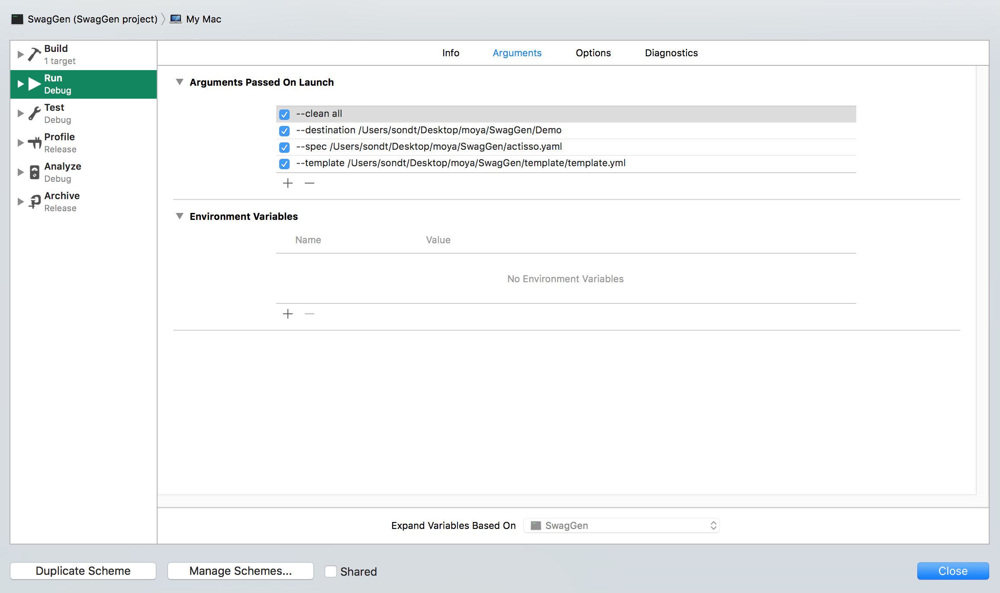

### Generate API with Swagger

1. Clone this SwagGen repo https://github.com/dangthaison91/SwagGen and follow its document to generate Network API from Swagger Spec. Please use template in `Templates/Swift-Moya`.

You can generate by command:
```ruby
SwagGen --template Templates/Swift-Moya --spec http://myapi.com/spec.yaml --destination generated --option name:MyAPI --option "customProperty: custom value --clean leave.files"
```

OR add arguments to your Target Scheme:



2. You will need to edit Podfile to fill in project target.
